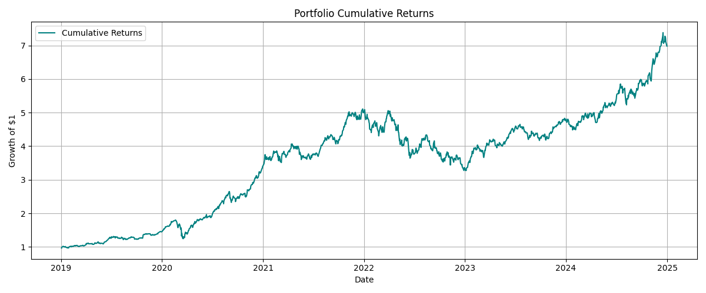
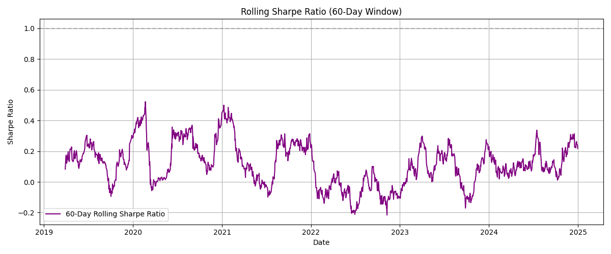

# Multi-Asset Portfolio Strategy

This project explores a simple momentum-based strategy across a diversified multi-asset portfolio consisting of:

- **AAPL** (Apple)
- **TSLA** (Tesla)
- **PFE** (Pfizer)
- **BTC-USD** (Bitcoin)
- **GLD** (Gold ETF)
- **SPY** (S&P 500 ETF)

The goal is to evaluate overall portfolio performance, understand risk-adjusted returns, and visualize dynamic Sharpe ratio changes over time.

---

## Strategy Overview

- Historical daily price data is fetched using `yfinance`
- Portfolio is **equal-weighted** across all selected assets
- Core metrics computed:
  - Total return
  - Annualized return
  - Annualized volatility
  - Sharpe ratio
  - Maximum drawdown
- Rolling **60-day Sharpe ratio** is used to observe changing risk-adjusted return

---

## Key Results

- **Total Return**: 598.00%  
- **Annualized Return**: 38.33%  
- **Sharpe Ratio**: 1.60  
- **Max Drawdown**: -35.90%

---

## Visual Output

### Cumulative Returns


### 60-Day Rolling Sharpe Ratio


---

## Tools Used

- `Python`
- `yfinance` – historical data retrieval
- `pandas`, `numpy` – data transformation
- `matplotlib` – visualization

---

## How to Use

```bash
git clone https://github.com/HaoyuTu/multi-asset-portfolio-strategy.git
cd multi-asset-portfolio-strategy
pip install yfinance pandas matplotlib
jupyter notebook